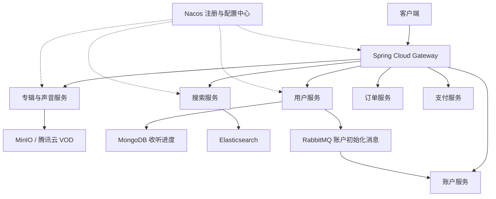

# 谷粒随享 · 听书平台后端


基于 Java、Spring Boot 与 Spring Cloud Alibaba 的听书与音频内容平台后端。通过 Maven 多模块组织公共能力、数据模型与业务微服务，实践专辑管理、音频上传、微信登录、收听进度和全文搜索等业务。

本项目基于尚硅谷「谷粒随享」课程进行学习与开发。仓库包含后端源码、接口参考文档，以及独立的 MongoDB 示例；不包含前端、数据库初始化脚本或完整 Nacos 配置。

## 功能与实现进度

| 领域 | 当前源码包含的能力 |
| --- | --- |
| 内容管理 | 分类与属性查询，专辑及声音的新增、修改、删除、分页查询 |
| 文件与音频 | MinIO 文件上传，腾讯云 VOD 音频上传，内容审核相关客户端配置 |
| 用户与认证 | 微信登录、用户信息维护、Redis 登录状态、自定义认证注解和网关过滤 |
| 收听进度 | 使用 MongoDB 保存进度，查询声音断点并更新收听位置 |
| 搜索 | Elasticsearch 专辑索引上下架、搜索、频道查询、自动补全和专辑详情 |
| 账户 | RabbitMQ 驱动的账户初始化；账户与充值模块包含实体、持久层及服务结构 |
| 订单与支付 | 已建立订单、支付模块及微信支付配置；公开业务接口仍需继续实现 |
| 调度 | 已建立调度服务与任务处理类，具体任务逻辑待实现 |

接口参考文档包含课程规划的接口，部分接口尚未在控制器中实现；请以当前源码为准。

## 技术栈

| 分类 | 技术 |
| --- | --- |
| 语言与构建 | Java 17、Maven 多模块 |
| 应用框架 | Spring Boot 3.0.5、Spring Cloud 2022.0.2、Spring Cloud Alibaba 2022.0.0.0-RC1 |
| 微服务 | Nacos、Spring Cloud Gateway、OpenFeign |
| 数据访问 | MySQL、MyBatis-Plus 3.5.3.1、MongoDB |
| 缓存与并发 | Redis、Redisson、线程池 |
| 搜索与消息 | Elasticsearch、RabbitMQ；项目亦包含 Kafka 相关依赖 |
| 存储与第三方 | MinIO、腾讯云 VOD、微信登录、微信支付 |
| 接口文档 | Knife4j / OpenAPI 3 |

## 架构



业务服务通过 OpenFeign 调用其他服务，共享公共模型和基础组件；MySQL、Redis 等依赖按服务配置接入。图中订单与支付节点表示已有模块，不代表完整交易流程已经完成。

## 项目结构

```text
tingshu/
├── README.md                       # 项目入口
├── tingshu-parent/                 # 听书后端 Maven 聚合项目
│   ├── pom.xml
│   ├── common/                     # 工具、服务基础能力、日志、RabbitMQ
│   ├── model/                      # 实体、DTO、VO
│   ├── server-gateway/             # 网关及认证过滤
│   ├── service-client/             # OpenFeign 接口及降级实现
│   ├── service/
│   │   ├── service-album/          # 分类、专辑、声音、上传
│   │   ├── service-user/           # 登录、用户、收听进度
│   │   ├── service-search/         # 搜索、索引、详情
│   │   ├── service-account/        # 账户及充值模块
│   │   ├── service-order/          # 订单模块
│   │   ├── service-payment/        # 支付模块
│   │   └── service-dispatch/       # 调度模块
│   └── docs/                       # 接口参考与开发笔记
└── mongo_demo/                     # 独立的 Spring Data MongoDB 示例
```

`mongo_demo` 不属于 `tingshu-parent` 的 Maven 聚合模块，需要单独构建。

## 本地开发

### 1. 获取项目与准备环境

```bash
git clone https://github.com/GooChen55/tingshu.git
cd tingshu
```

安装 JDK 17 与 Maven，使用 IDE 导入 `tingshu-parent/pom.xml`，按需要导入 `mongo_demo/pom.xml`。

按运行模块准备 MySQL、Redis、Nacos、RabbitMQ、Elasticsearch、MongoDB。文件上传需要 MinIO 与腾讯云 VOD 配置，微信登录和支付需要相应的应用及商户配置。

### 2. 配置 Nacos 与数据库

各服务的 `src/main/resources/bootstrap.properties` 默认使用 `dev` 环境，Nacos 示例地址为 `192.168.200.6:8848`，需替换为实际地址，也可通过环境变量覆盖：

```powershell
$env:SPRING_CLOUD_NACOS_DISCOVERY_SERVER_ADDR = "127.0.0.1:8848"
$env:SPRING_CLOUD_NACOS_CONFIG_SERVER_ADDR = "127.0.0.1:8848"
```

在 Nacos 中添加共享配置 `common.yaml` 和对应服务配置，例如 `service-album-dev.yaml`、`service-user-dev.yaml`、`service-search-dev.yaml`、`server-gateway-dev.yaml`。服务配置的前缀来自 `spring.application.name`，后缀为 `yaml`，环境为 `dev`。

配置数据库连接、缓存、消息队列、搜索集群、服务端口与网关路由；创建与 Mapper、实体匹配的数据库结构。第三方配置字段见 [配置说明](tingshu-parent/docs/configuration.md)。本仓库未提供可直接导入的建表脚本与完整配置导出，因此克隆后需要自行准备运行环境。

### 3. 构建后端

在仓库根目录执行：

```bash
mvn -f tingshu-parent/pom.xml clean package -DskipTests
```

该命令编译主代码和测试代码并打包，跳过测试执行。现有测试涉及数据库与外部服务；运行前请准备相应环境。

### 4. 启动服务

通过 IDE 运行各服务的 `*Application` 主类，如 `ServiceAlbumApplication`、`ServiceUserApplication`、`ServiceSearchApplication` 和 `ServerGatewayApplication`。先启动基础设施，再启动所需业务服务与网关，并确认服务已注册至 Nacos。

业务服务端口及网关路由以实际配置为准；运行服务后，可尝试通过该服务的 `/doc.html` 查看 Knife4j 文档，实际地址受网关与文档配置影响。

### 5. MongoDB 示例（可选）

修改 `mongo_demo/src/main/resources/application.yml` 中的 MongoDB 地址、端口和数据库，随后执行：

```bash
mvn -f mongo_demo/pom.xml clean package -DskipTests
mvn -f mongo_demo/pom.xml spring-boot:run
```

## 文档与参与开发

- [接口参考](tingshu-parent/docs/api.md)：课程接口定义，实际实现以控制器为准。
- [配置说明](tingshu-parent/docs/configuration.md)：Nacos 与第三方配置字段。
- [开发与学习笔记](tingshu-parent/docs/development-notes.md)：开发过程记录。
- [提交问题或建议](https://github.com/GooChen55/tingshu/issues)：请注明模块、复现步骤与已脱敏的日志。

修改公共模型或 Feign 接口时，请一并检查调用模块。提交代码前执行相关模块构建；不要提交密码、云服务密钥、微信商户证书或本地环境文件。

## 项目来源与许可

本项目基于尚硅谷「谷粒随享」课程学习与开发，原始课程代码及相关素材的权利归其各自权利人所有。当前仓库未声明开源许可证。
